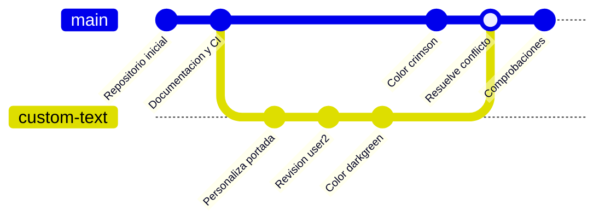

# git-work — Repositorio colaborativo Git

Repositorio de la práctica AE1 para aprender y demostrar el flujo colaborativo de Git: ramas, issues, pull requests, resolución de conflictos, etiquetas, releases e integración continua.

## Índice

- [Entorno e instalación](#entorno-e-instalación)
- [Configuración](#configuración)
- [Comprobación](#comprobación)
- [Flujo colaborativo](#flujo-colaborativo)
- [Problemas encontrados y solución](#problemas-encontrados-y-solución)
- [Repositorio remoto](#repositorio-remoto)

## Entorno e instalación

La práctica se ha realizado en Ubuntu con Git y GitHub CLI (`gh`).

La copia local del proyecto se encuentra en:

```text
~/dpl/ae1/
```

Para obtener una copia del repositorio:

```bash
git clone https://github.com/johnfredyrg1226/ae1.git
cd ae1
```

El proyecto contiene una página web básica formada por `index.html` y `css/cover.css`.

La documentación se configura mediante `mkdocs.yml` y `docs/index.md`.

## Configuración

Git está configurado con el nombre y correo del alumno:

```text
john fredy ramirez garcia <johfredy@hotmail.com>
```

Para representar el trabajo colaborativo en modalidad individual se utilizó también un usuario espejo:

```text
user2 espejo <user2@correo.com>
```

Se creó la rama:

```text
custom-text
```

En `css/cover.css` se modificó el color de la portada y se mantuvo la sombra mediante `text-shadow`.

El resultado final del color después de resolver el conflicto es:

```css
color: darkgreen;
```

El archivo `.gitignore` excluye:

```text
.env
*.log
.DS_Store
```

## Comprobación

Las salidas reales de los comandos utilizados para verificar la práctica están almacenadas en `comprobaciones.txt`.

Entre los comandos utilizados se encuentran:

```bash
git log --oneline --graph --all
git remote -v
git tag
git log --format='%an <%ae>' | sort -u
git status
gh pr list --state all
gh issue list --state all
gh release list
```

La integración continua se ejecutó correctamente en el Pull Request, obteniendo los checks en estado satisfactorio.

## Flujo colaborativo

El flujo realizado durante la práctica fue:



Se utilizaron issues, la rama `custom-text` y el Pull Request #2 para representar el trabajo colaborativo.

Durante la fusión de `custom-text` con `main`, Git detectó un conflicto en `css/cover.css`.

La rama `main` contenía:

```css
color: crimson;
```

mientras que el cambio entrante de `custom-text` contenía:

```css
color: darkgreen;
```

El conflicto se resolvió conservando el cambio entrante:

```css
color: darkgreen;
```

Finalmente se realizó el commit de fusión y se integraron los cambios en `main`.

## Problemas encontrados y solución

| Problema | Causa | Solución |
|---|---|---|
| Conflicto en `css/cover.css` | `main` y `custom-text` modificaron la misma línea con colores diferentes | Se resolvió manualmente conservando `darkgreen` |
| Git mostró marcadores `<<<<<<<`, `=======` y `>>>>>>>` | Git no podía decidir automáticamente qué versión conservar | Se eliminaron los marcadores y se mantuvo el cambio entrante |
| PR pendiente de revisión | El flujo colaborativo necesitaba conversación | Se añadió un comentario de revisión al Pull Request |
| Verificación de CI | Era necesario comprobar la construcción automática | Se ejecutó `gh pr checks 2` y los checks finalizaron correctamente |

## Repositorio remoto

Repositorio público:

https://github.com/johnfredyrg1226/ae1

Pull Request principal:

https://github.com/johnfredyrg1226/ae1/pull/2

Issue de trabajo:

https://github.com/johnfredyrg1226/ae1/issues/3

Release 0.1.0:

https://github.com/johnfredyrg1226/ae1/releases/tag/0.1.0

## Revisión colaborativa

La modalidad individual utiliza un usuario espejo (`user2`) para documentar el segundo papel del flujo colaborativo.

El historial conserva los commits de ambos autores, la rama de trabajo, el conflicto, su resolución y el merge final.
